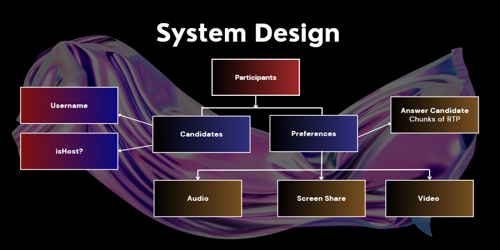

## Adichunchanagiri Institute of Technology - WeXpert
- Team Lead : Abhishek B (abhishekb2610@gmail.com)
- Member 1  : Amaan M K (syedkhalander66@gmail.com)
- Member 2  : Abdul Rahman (rahmanckm018@gmail.com)

## Problem Statement
### Sign Language Translator for Virtual Meetings : 
<p> The goal is to enhance accessibility in virtual meetings by developing a plugin for platforms like Microsoft Teams or Zoom that translates spoken conversations into sign language in real-time. This will allow users who are deaf or hard of hearing to fully engage in conversations by providing seamless translation of spoken words into sign language.
</p>

## System Architecture
<div align="center">
  
  
</div>

## Tech Stack
### Frontend
- ReactJs
- Tailwind CSS
- Framer Motion

### Backend
- NodeJs
- Python(flask)
- Firebase

## Instructions on running your project
## Installation 
<!-- install dependencies -->
### FontAwesome
```bash
npm install --save @fortawesome/react-fontawesome @fortawesome/free-solid-svg-icons
```

### XLSX for Excel file handling
```bash
npm install --save xlsx
```

### React Router
```bash
npm install --save react-router-dom
```

### React Redux
```bash
npm install --save react-redux redux
```

### React Tooltip
```bash
npm install --save react-tooltip
```

### React Calendar
```bash
npm install --save react-calendar
```
### Google Authentication Key
```bash
npm install react-google-login
```

### Firebase
```bash
npm install --save firebase
```

## Demo
### Demo Video Link
[https://drive.google.com/drive/folders/1C87KQ24cIO4zw351NnizWqCa2uIhsaMO](https://drive.google.com/drive/folders/1C87KQ24cIO4zw351NnizWqCa2uIhsaMO)
<br/>
👆👆👆👆

### Demo Presentation Link
[https://www.canva.com/design/DAGHdsTabMw/t4ZVZM6K-1Rvpby1GuCpXA/view?utm_content=DAGHdsTabMw&utm_campaign=designshare&utm_medium=link&utm_source=editor](https://www.canva.com/design/DAGHdsTabMw/t4ZVZM6K-1Rvpby1GuCpXA/view?utm_content=DAGHdsTabMw&utm_campaign=designshare&utm_medium=link&utm_source=editor)
<br/>
👆👆👆👆

### Demo Webpage Link
https://xpert-video-meet.vercel.app/
<br/>
👆👆👆👆

<!-- run below commands -->
- Run npm install.
- Add your firebase config details to Server/firebase.js.
- Run "npm start" to start the app.

## References
- React JS Docs: <a href="https://react.dev/">React</a> <br>
  A JavaScript library for building interactive user interfaces for web applications.
  
- Firebase Docs: <a href="https://firebase.google.com/docs/">Firebase</a> <br>
  Firebase facilitates video call apps by providing real-time database for user authentication and session management.
  
- Framer Motion Docs : <a href="https://www.framer.com/motion/">Framer</a> <br>
  Animations that work like magic. When animating between two separate components, Framer Motion will take care of everything in between.
